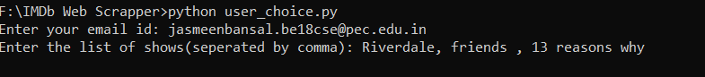
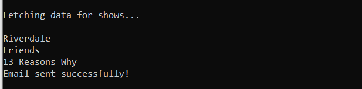
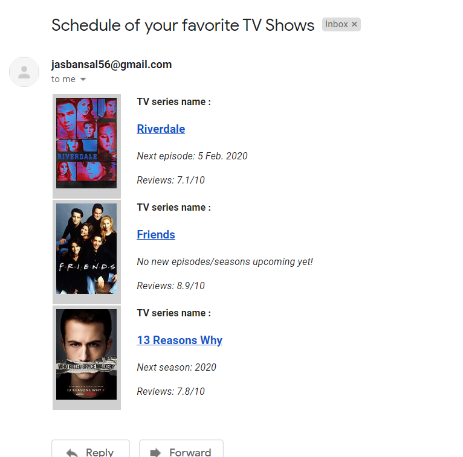

# IMDb-Scrapper
Description: The Python script will require an email address and a list of favorite TV series for multiple users as input. Then, it will store the input data in the MySQLdb table(s). A single email will be sent to the provided email address with all the appropriate responses(like the next telecast date, IMDb rating, etc) for every TV series.

User Input:

Fetching data:

Final output Email:

